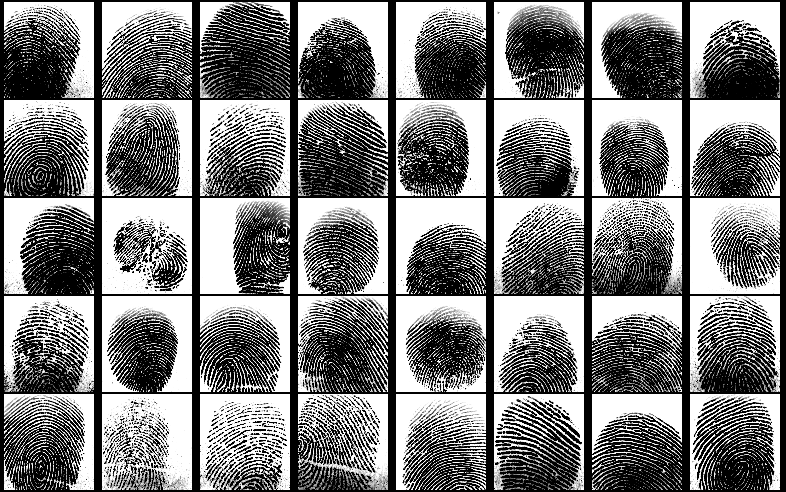
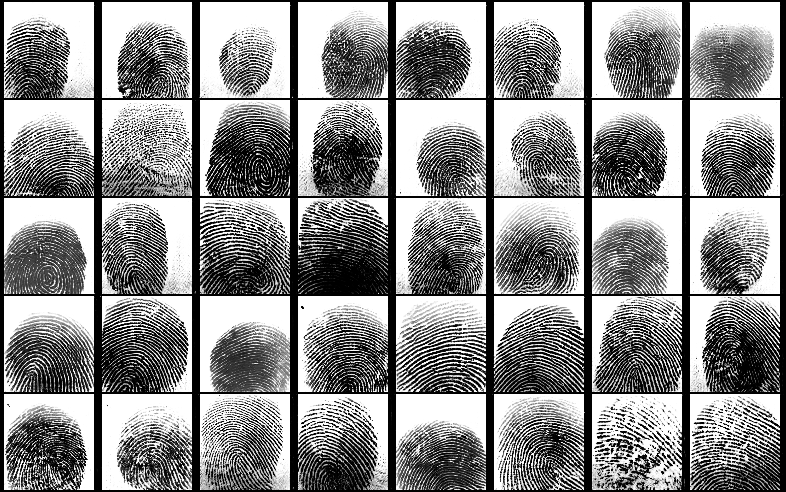
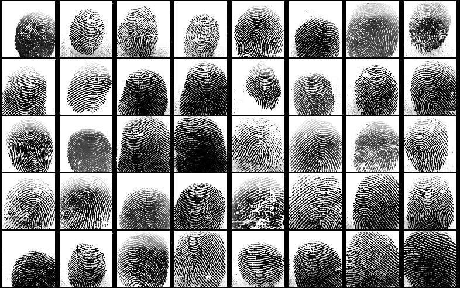

# BIO: Generování syntetických otisků prstů pomocí GAN

Tento projekt byl vypracován v rámci předmětu **biometrické systémy** na Fakultě informačních technologií 
Vysokého učení technického v Brně. Cílem projektu je generovat syntetické otisky prstu pomocí 
generative adversarial networks (GAN).

Autoři: Lukáš Salvet, xsalve02, Jan Svoboda, xsvobo0s

## Úvod

GAN je typ neuronové sítě představený v roce 2014 používaný, mimo jiné pro generování nových dat z určité distribuce [1]. 
Princip spočívá v soutěžení dvou neuronových sítí: generátoru, který generuje dat z náhodné šumu a diskriminátoru, který se snaží 
odlišit reálná data od těch vygenerovaných.

## Hledání datasetu

Prvním krokem bylo nalezení vhodných trénovacích dat. Na internetu již bohužel nejsou k nalezení rozsáhlé datasety 
společnosti NIST. Po zvážení několika kandidátů [2] [3] [4] [5] jsme zvolili dataset SOCOFing dostupný na Kaggle [6] 
pro největší množství otisků a relativně kvalitní snímky.

Dataset bylo nutno upravit - bylo třeba oříznout rámečky kolem otisků prstů a změnit rozměry snímků tak, 
aby seděli na downsampling jednotlivých vrstev použité neuronové sítě. V názvech obrázků datasetu byly zakódovány 
informace o typu prstu a pohlaví subjektu. Tyto informace jsme použili při učení sítě. Je předpoklad, že pokud by se
jednotlivé kategorie od sebe lišili, pomůžou tyto informace síti při učení. 

## Volba architektury

Po nastudování mnoha *state of the art* technik a architektur GAN [7] [8] [9] [10] [11] [12] [13] [14] [15] [16] [17] 
a několika publikací zabývajících se generováním otisků prstů [18] [19] [20] jsme jako základ modelu použili existující 
implementaci [21] architektury BigGAN.

Tu jsme pozměnili tak, aby dokázala pracovat s šedotónovými obrázky ve větším rozlišení (96x96 pixelů oproti původním 64x64 pixelům). 
Zároveň jsme implementovali infrastrukturu pro ukládání a snadné načítání naučených modelů.

Subjektivně kvalitní obrázky náš model generuje po cca 10 tisících iteracích učení, které na jedné grafické kartě NVIDIA TESLA P100 trvá zhruba 5 hodin.

## Vyhodnocení

Vyhodnocování kvality GAN je stále oblastní aktivního výzkumu a prozatím neexistuje standardizovaná generická metoda. 
Často používané metriky jsou Inception Score [11] a Fréchet Inception Distance [12], které používají model naučený na datasetu ImageNet 
pro získání features, nad kterými pak provádí další analýzu. 
Jelikož tento dataset ale neobsahuje žádné otisky prstů, použití těchto modelů pro náš účel nejspíš nedává smysl.

Podle některých zdrojů [13] může být vhodnou metrikou např. manuální porovnávání vygenerovaných obrázků 
s jejich nejbližšími sousedy z trénovacího datasetu (ve smyslu Nearest Neighbor klasifikátoru). Touto metodou by se dalo zjistit, 
jak unikátní data je generátor schopný vytvořit. Při použití Nearest Neighbor jsme sice získali páry otisků, které jsou si tvarově podobné, 
zpravidla však byly markantově naprosto odlišné.

Pokusili jsme se tedy hledat páry obrázků na základě podobnosti markantů. Pro tento účel jsme použili Java knihovnu SourceAFIS [14], 
která ovšem párovala diametrálně odlišné otisky. Doposud jsme nezjistili příčinu špatné funkčnosti. Je možné, že detektoru 
markantů dělaly potíže lehké artefakty, které se objevují na vygenerovaných obrázcích.

## Závěr

Podařilo se nám vytvořit funkční generátor otisků prstů založený na GAN. Tento model by měl být lehce
škálovatelný (podle [Brock et al., 2019]) i pro generování snímků s větším rozlišením. Při manuální inspekci vygenerovaných 
otisků v drtivé většině případů vypadají jako reálné otisky a obsahují rozpoznatelné markanty. 
Do budoucna by to chtělo implementovat automatické vyhodnocení kvality a diverzity generovaných dat.

## Popis použité architektury:
- Síť založena na BigGAN [Brock et al., 2019]
- Spectral Normalization [Miyato et al., 2018] pro lepší stabilitu učení.
- Self-attention [[Zhang et al., 2018]] - lepší kvalita
- Auxiliary classifier [Odena et al., 2017] - lepší kvalita a stabilita učení.
- Residual blocks [He et al., 2016] - Umožňuje efektivní trénování hlubokých sítí (lepší propagace gradientu), lepší kvalita
- Minibatch Standard Deviation [Karras et al., 2018] pro lepší rozmanitost generovaných dat.
- Loss: RaLS [Jolicoeur-Martineau et al., 2019] s váhovanou auxiliary classification loss [Odena et al., 2017]
- Uniform input noise na reálné obrázky
- Shared embedding 

### Trénovací data

### Vygenerované obrázky
 \\

---

[[1]](https://arxiv.org/abs/1406.2661) Ian J. Goodfellow, Jean Pouget-Abadie, Mehdi Mirza, Bing Xu, David Warde-Farley, Sherjil Ozair, Aaron Courville, Yoshua Bengio. *Generative Adversarial Networks*, 2014.

[2] CASIA FingerprintV5, dostupné zde: [idealtest.org](http://www.idealtest.org/dbDetailForUser.do?id=7) (po registraci).

[3] Hong Kong Polytechnic University Fingerprint Images Database, dostupné zde: [comp.polyu.edu.hk](http://www4.comp.polyu.edu.hk/~csajaykr/fingerprint.htm) (po registraci).

[4] FVC2006, dostupné zde: [atvs.ii.uam.es](http://atvs.ii.uam.es/atvs/fvc2006.html) (po registraci učitele)

[5] NIST dataset SD04, dostupné z neoficiálních zdrovů.

[6] SOCOFing, dostupné zde: [kaggle.com](https://www.kaggle.com/ruizgara/socofing).

[[7]](https://arxiv.org/abs/1809.11096) Andrew Brock, Jeff Donahue, Karen Simonyan. *Large Scale GAN Training for High Fidelity Natural Image Synthesis*, 2019.

[[8]](https://arxiv.org/abs/1512.03385) Kaiming He, Xiangyu Zhang, Shaoqing Ren, Jian Sun. *Deep residual learning for image recognition*, 2016.

[[9]](https://arxiv.org/abs/1807.00734) Alexia Jolicoeur-Martineau. *The relativistic discriminator: a key element missing from standard GAN*, 2019.

[[10]](https://arxiv.org/abs/1610.09585) Augustus Odena, Christopher Olah, Jonathon Shlens. *Conditional image synthesis with auxiliary classifier GANs*, 2017.

[[11]](https://arxiv.org/abs/1805.08318) Han Zhang, Ian Goodfellow, Dimitris Metaxas, Augustus Odena. *Self-attention generative adversarial networks*, 2018.

[[12]](https://arxiv.org/abs/1802.05957) Takeru Miyato, Toshiki Kataoka, Masanori Koyama, Yuichi Yoshida. *Spectral normalization for generative adversarial networks*, 2018.

[[13]](https://arxiv.org/abs/1710.10196) Tero Karras, Timo Aila, Samuli Laine, Jaakko Lehtinen. *Progressive Growing of GANs for Improved Quality, Stability, and Variation*, 2018.

[[14]](https://arxiv.org/abs/1812.04948) Tero Karras, Samuli Laine, Timo Aila. *A Style-Based Generator Architecture for Generative Adversarial Networks*, 2018.

[[15]](https://arxiv.org/abs/1809.11096) Andrew Brock, Jeff Donahue, Karen Simonyan. *Large Scale GAN Training for High Fidelity Natural Image Synthesis*, 2019.

[[16]](https://arxiv.org/abs/1805.08318) Han Zhang, Ian Goodfellow, Dimitris Metaxas, Augustus Odena. *Self-Attention Generative Adversarial Networks*, 2019.

[[17]](https://arxiv.org/abs/1706.08500) Martin Heusel, Hubert Ramsauer, Thomas Unterthiner, Bernhard Nessler, Sepp Hochreiter. *GANs Trained by a Two Time-Scale Update Rule Converge to a Local Nash Equilibrium*, 2018.

[[18]](https://arxiv.org/abs/1812.10482) Shervin Minaee, Amirali Abdolrashidi. *Finger-GAN: Generating Realistic Fingerprint Images Using Connectivity Imposed GAN*, 2018.

[[19]](https://arxiv.org/abs/1705.07386) Philip Bontrager, Aditi Roy, Julian Togelius, Nasir Memon, Arun Ross. *DeepMasterPrints: Generating MasterPrints for Dictionary Attacks via Latent Variable Evolution*, 2017.

[[20]](https://ieeexplore.ieee.org/document/8411200) Kai Cao, Anil Jain. *Fingerprint Synthesis: Evaluating Fingerprint Search at Scale*, 2018.

[21] RaLS AC-BigGAN with MinibatchStddev, dostupné zde: [kaggle.com](https://www.kaggle.com/yukia18/sub-rals-ac-biggan-with-minibatchstddev).

## Evaluation

- [Xu Q. et al., 2018] [An empirical study on evaluation metrics of generative adversarial networks](https://arxiv.org/pdf/1806.07755.pdf)
- [Borji A., 2018] [Pros and Cons of GAN Evaluation Measures](https://arxiv.org/pdf/1802.03446.pdf)
- [Shmelkov K., Schmid C., Alahari K, 2018] [How good is my GAN?](https://hal.inria.fr/hal-01850447/document)
